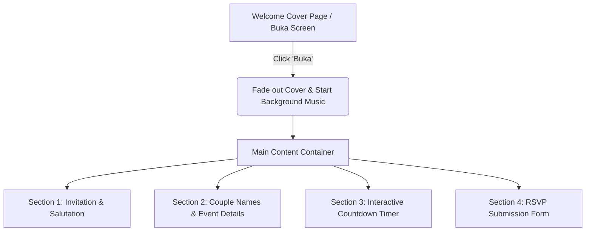

# 🕊️ Digital Wedding Card (Ariff & Anis)

A premium, single-page, static digital wedding invitation card built with a modern minimalist aesthetic, mobile-first design, and interactive details.

---

## 🎨 Design System & Aesthetics

### Theme: Modern Minimalist (Blueish White, Gold & Floral)
The visual layout uses **glassmorphism** (semi-transparent blurred overlays), clean typography, and delicate floral highlights.

*   **Color Palette (Controlled via CSS Variables)**:
    *   `--primary-bg`: Blueish White (`#F0F4F8` / `#E2E8F0` gradient)
    *   `--surface-card`: Translucent White (`rgba(255, 255, 255, 0.75)` with `backdrop-filter: blur(10px)`)
    *   `--accent-gold`: Classic Gold (`#D4AF37` / `#C5A059`) for headings, borders, and buttons
    *   `--text-navy`: Midnight Blue/Navy (`#1B2A4A`) for readable text
*   **Typography**:
    *   `--font-cursive`: Playfair Display / Great Vibes (via Google Fonts)
    *   `--font-sans`: Inter / Montserrat for clean, high-readability details
*   **Deco elements**: Elegant white floral roses as floating background accents and frame ornaments.

### 🔄 Future Theme Switching
To answer the question about future customization, the design is structured around **CSS Custom Properties (Variables)** at the top of [style.css](file:///d:/Projects/kadkahwin/style.css). Changing the theme in the future is as easy as:
1.  Changing the color hex variables and font links in [style.css](file:///d:/Projects/kadkahwin/style.css).
2.  Replacing the background image asset files (`floral_bg.png` or `cover_bg.png`) in the `/assets/images/` directory with the new design's assets.
No structural HTML edits will be required.

---

## 🛠️ Technical Stack

*   **HTML5**: Semantic web structure.
*   **CSS3**: Vanilla CSS for custom animations, scroll effects, and custom colors.
*   **Bootstrap 5.3 (CDN)**: Utilized for responsive layout scaffolding (`container`, `row`, `col`), typography scaling, flex layout helpers, and built-in components.
*   **FontAwesome 6 (CDN)**: Premium vector icons.
*   **Vanilla JavaScript (ES6+)**: Custom handlers for:
    *   Cover fade-out
    *   Background music play/pause toggle
    *   Countdown timer
    *   Bottom navigation button scrolling and modal popups
*   **RSVP Backend**: Form submission integration with **Firaform API**.

---

## 🗺️ Page Flow & Sections



### 1. The Welcome Cover ("Buka" Transition)
*   **Layout**: Full-screen overlay (`100vh`/`100vw`) styled with a subtle blueish-white gradient and soft gold floral elements.
*   **Content**: Ariff & Anis names, date of wedding, address, and a floating **"BUKA" (Open)** button.
*   **Interactivity**:
    *   Clicking **"BUKA"** starts the background instrumental audio.
    *   Animate-out: The overlay fades out and scales down smoothly using CSS transitions.
    *   Enables scrolling for the rest of the page.

### 2. Top Section (Invitation & Event Details)
*   **Salutation**: A warm Islamic/generic welcoming text ("Assalamualaikum w.b.t..." and "Dengan penuh kesyukuran...").
*   **Bride & Groom Details**: Elegant cursive names with a hint of gold styling.
*   **Venue & Date Details**: Date, Islamic Calendar date, time, and full address.
*   **Tentative Program**: A clean, elegant schedule outline showing arrival times, bride/groom entrance, meals, cake cutting, and photography sessions.

### 3. Interactive Countdown Timer
*   **Layout**: Floating countdown panels showing **Days | Hours | Mins | Secs**.
*   **Logic**: Real-time decrementing countdown until the wedding date.

### 4. RSVP Section
*   **Form fields**:
    *   Full Name (*Nama*)
    *   Attendance (*Kehadiran*: Yes/No/Maybe)
    *   Number of Pax (*Bilangan Tetamu*)
    *   Wishes/Message (*Ucapan*)
*   **Action**: Form posts data asynchronously (via JavaScript `fetch`) to the **Firaform API Endpoint** and displays a custom thank-you modal.

---

## ⚓ Bottom Navigation Bar & Modal System

A fixed bottom navigation bar will display **5 interactive buttons** optimized for mobile thumb-reach:

| Button | Action | Modal / Popup Behavior |
| :--- | :--- | :--- |
| **1. Hubungi** | Pops up Bottom Modal | Shows 3 contact persons. Each contact has two buttons: **Direct Call** (`tel:`) and **WhatsApp** (`https://wa.me/`). |
| **2. Lokasi** | Pops up Bottom Modal | Displays two navigation options: **Waze Link** and **Google Maps Link**. |
| **3. RSVP** | Smooth Scroll | **Main Action Button**: Located in the center. Designed to be larger and styled as a raised, floating circular button for maximum visibility. Smoothly scrolls the viewport to the RSVP form section. |
| **4. Kalendar** | Pops up Bottom Modal | Displays calendar date with buttons to add the event to **Google Calendar** and **Apple Calendar** (ICS file). |
| **5. Sumbangan** | Pops up Bottom Modal | Shows a notice overlay first. Once dismissed, reveals the Maybank QR code. Includes a **Download QR** button. |

### Details for the "Sumbangan" Modal Notice:
1.  When clicked, a warning/notice overlay appears **first**.
2.  The user must click an **"X" (Dismiss)** button or **"Teruskan"** button to reveal the actual QR code.
3.  **Disclaimer Message**: *"Sumbangan ini tidak wajib dan ikhlas semata-mata. Disediakan khusus untuk kemudahan cashless sahaja (terutamanya untuk rakan-rakan Gen Z)."*
4.  Once revealed, the Maybank DuitNow QR image is shown along with a link/button to download/save the QR image.

---

## 📁 Repository Structure

```
d:/Projects/kadkahwin/
├── README.md                      # Project specifications (this file)
├── index.html                     # Main digital card HTML document
├── style.css                      # Custom theme styling & glassmorphism components
├── app.js                         # Custom JS logic (audio, timer, forms, modal states)
└── assets/                        # Assets directory
    ├── audio/
    │   └── background_music.mp3   # Background instrumental track
    ├── images/
    │   ├── qr_code.png            # Maybank DuitNow QR Code image
    │   ├── floral_bg.png          # Aesthetic floral rose decorations
    │   └── passport_photo.png     # Uploaded passport photo
    └── favicon.ico                # Page favicon
```
